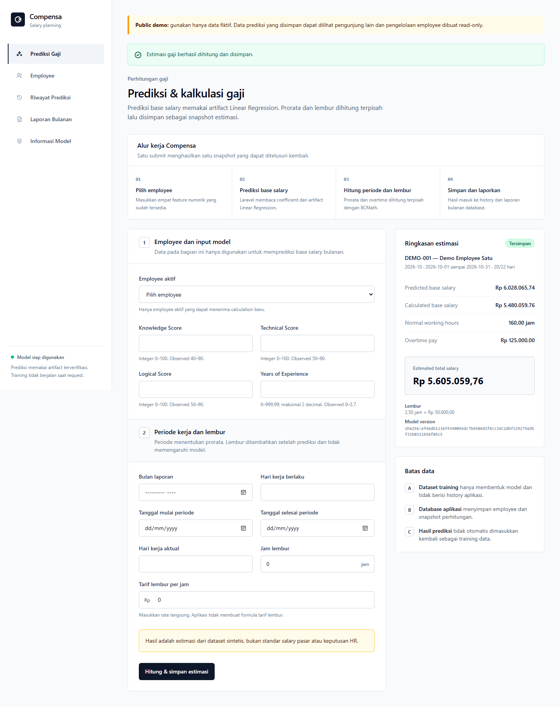
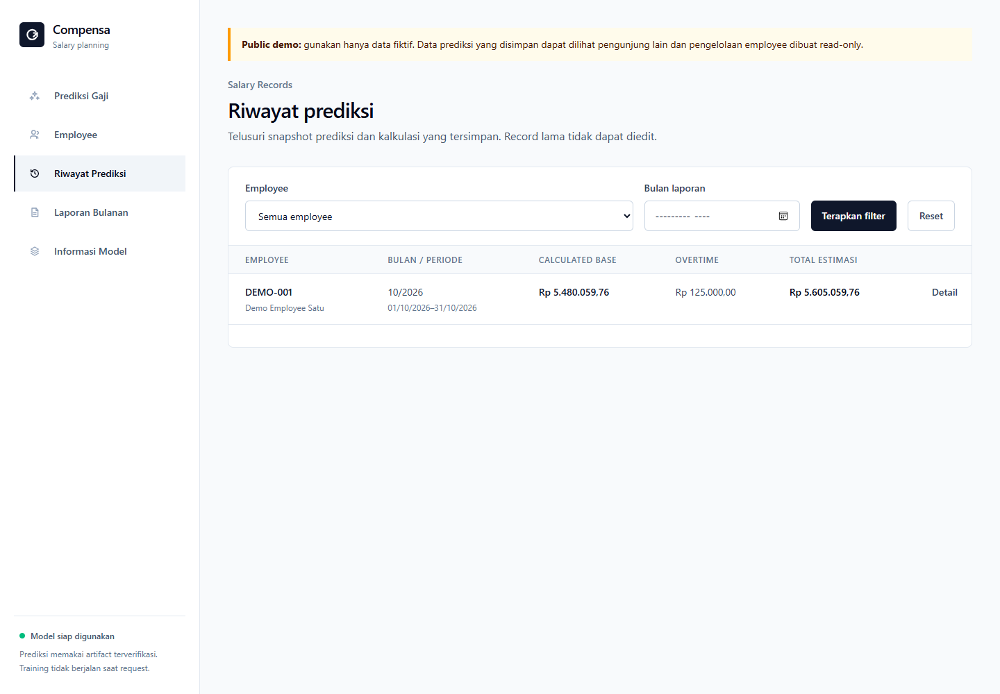
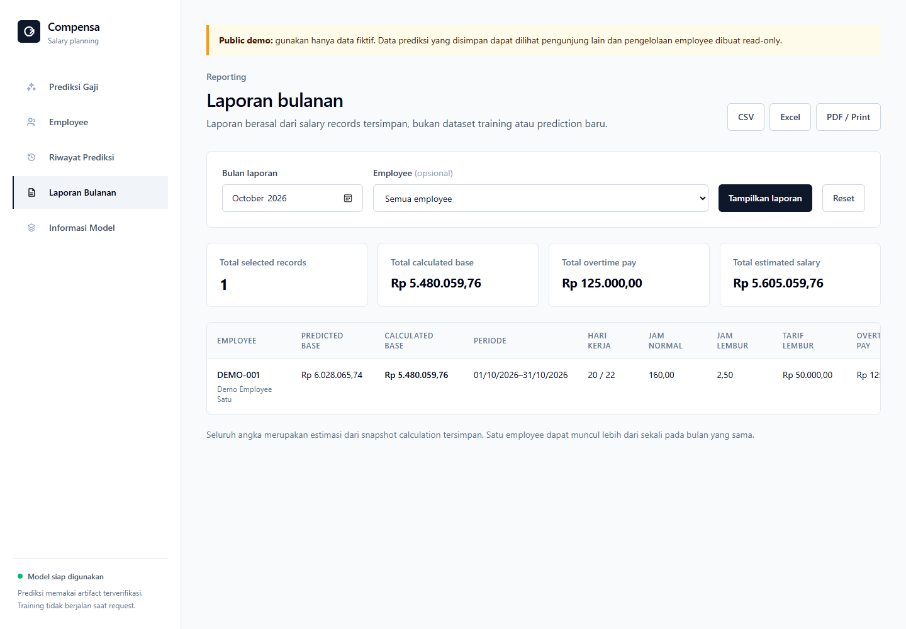
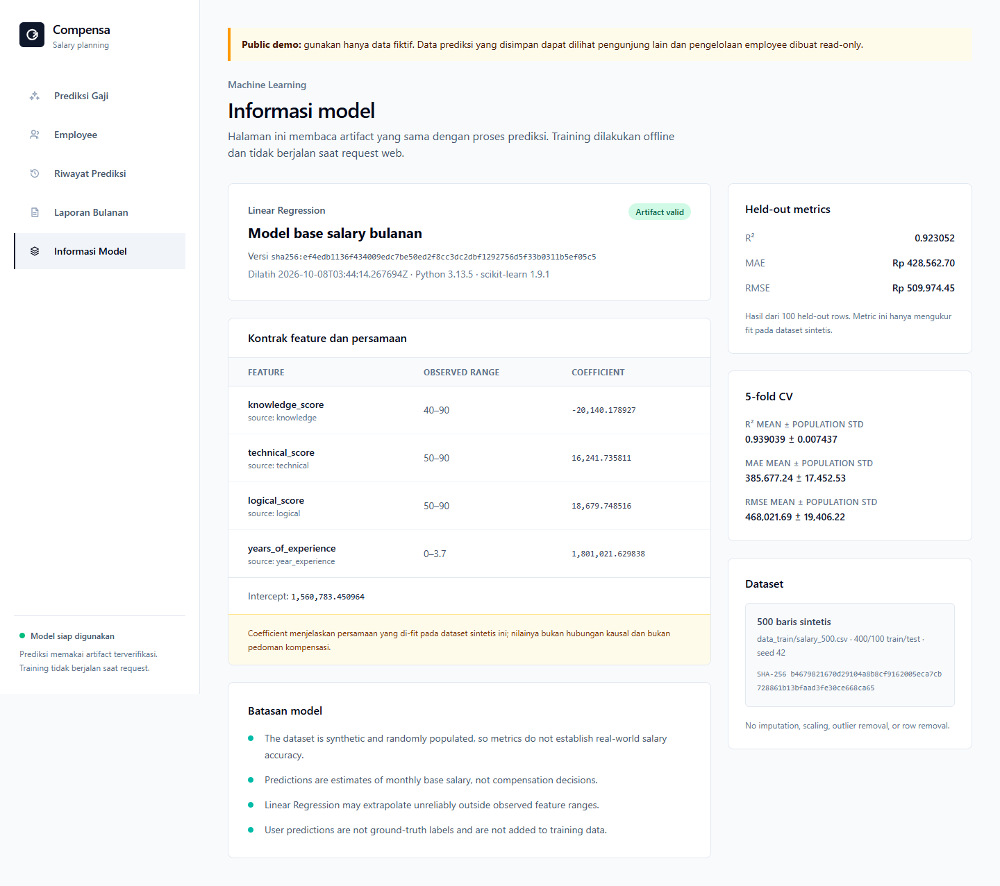
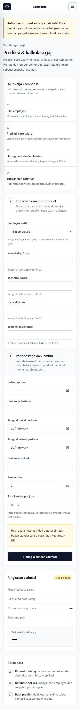
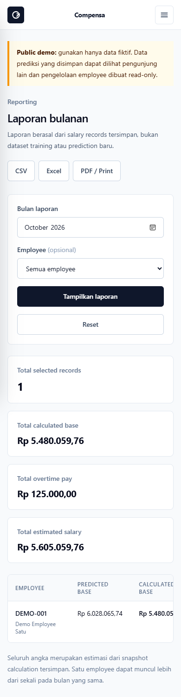

# Compensa

Compensa adalah aplikasi portfolio Laravel untuk memprediksi base salary dengan Linear Regression, menghitung prorata periode kerja dan overtime, menyimpan snapshot hasil, serta membuat laporan bulanan. Project ini menunjukkan integrasi web, database, machine learning offline, dan reporting tanpa berkembang menjadi sistem payroll/HR yang kompleks.

> Status release: **Milestone 6 complete locally / Laravel Cloud deployment-ready**. Belum ada deployment live; smoke test PostgreSQL dan URL publik tetap pending sampai environment Laravel Cloud tersedia.

## Fitur

- Employee management minimal, dengan status aktif/nonaktif tanpa delete.
- Prediksi base salary dari Knowledge, Technical, Logical, dan Years of Experience.
- Kalkulasi prorata dan overtime memakai BCMath; overtime bukan feature model.
- Riwayat salary record immutable dan detail technical snapshot.
- Laporan bulanan dari database dengan CSV, XLSX, serta browser Print/Save as PDF.
- Model Information dari artifact aktual, termasuk contract, metric, dan limitations.
- Public demo mode: employee read-only, prediction tetap aktif, banner data fiktif, rate limiting, dan response security headers.

## Alur kerja web

1. User memilih employee aktif dan memasukkan Knowledge Score, Technical Score, Logical Score, serta Years of Experience.
2. Laravel membaca coefficient dan intercept dari artifact JSON, lalu menghasilkan **predicted base salary bulanan**. Tidak ada proses training pada request.
3. Sistem menghitung **calculated base salary** secara prorata dari worked days dibanding applicable work days; jam normal adalah worked days × 8.
4. Overtime dihitung terpisah dari model: overtime hours × rate yang dimasukkan user. Aplikasi tidak mengarang formula rate.
5. Calculated base dan overtime pay dijumlahkan menjadi **estimated total salary**, kemudian input, output, periode, dan model version disimpan sebagai satu snapshot immutable.
6. Snapshot tersebut muncul pada Prediction History dan menjadi sumber Monthly Report, CSV, XLSX, serta Print/PDF.

Dataset training dan database aplikasi tidak bercampur. Dataset hanya membentuk artifact model; salary record hasil penggunaan web tidak otomatis menjadi training data karena bukan ground truth.

## Tampilan

| Desktop | Desktop |
| --- | --- |
|  |  |
|  |  |

| Mobile | Mobile |
| --- | --- |
|  |  |

## Arsitektur

```text
verified CSV -> offline Python training/evaluation -> trusted JSON artifact
                                                        |
browser -> Laravel validation -> PHP inference -> BCMath calculation
                                      |                 |
                                      +------> PostgreSQL/SQLite
                                                   |
                                 history -> monthly report -> CSV/XLSX/print
```

Laravel 13 menjadi modular monolith untuk HTTP, Blade UI, validation, inference, calculation, Eloquent, dan reporting. Python/scikit-learn hanya dipakai offline untuk training; production tidak menjalankan Python. Runtime membaca artifact JSON yang sudah di-commit dari fixed project path.

Stack utama: PHP 8.4, Laravel 13, Blade, Tailwind CSS, Vite, SQLite lokal, PostgreSQL deployment, Python 3.13, scikit-learn, pandas, Pest, Pint, unittest, dan Ruff.

## Setup lokal

Prasyarat: PHP 8.4 dengan BCMath dan ekstensi `gd`, `mbstring`, XML, ZIP, SQLite; Composer; Node.js/NPM; serta Python 3.13 untuk training. Laravel Herd direkomendasikan pada Windows.

```bash
composer install
cp .env.example .env
php artisan key:generate
php artisan migrate
php artisan app:seed-demo-data
npm ci
npm run build
```

Di PowerShell, gunakan `Copy-Item .env.example .env`. Jalankan melalui Herd atau `php artisan serve`, lalu buka root URL. Health check tersedia di `/up`.

Demo seed bersifat idempotent dan hanya membuat tiga employee fiktif: `DEMO-001`, `DEMO-002`, dan `DEMO-003` (nonaktif). Contoh input:

```text
Employee: DEMO-001
Knowledge / Technical / Logical: 65 / 70 / 70
Years of Experience: 1.85
Reporting month: 2026-10
Period: 2026-09-20 s.d. 2026-10-20
Applicable / worked days: 22 / 20
Overtime: 2.50 jam @ Rp 50.000,00
```

## Training dan evaluasi

```bash
python -m venv ml/.venv
python -m pip install -r ml/requirements.txt
python ml/train.py --dataset data_train/salary_500.csv
```

Trainer memvalidasi exact schema dan SHA-256 dataset, memakai deterministic shuffled split 400/100 (seed 42), menjalankan five-fold CV hanya pada training rows, lalu menulis artifact secara atomik. Model tidak dilatih saat request.

- Model version: `sha256:ef4edb1136f434009edc7be50ed2f8cc3dc2dbf1292756d5f33b0311b5ef05c5`
- Dataset SHA-256: `b4679821670d29104a8b8cf9162005eca7cb728861b13bfaad3fe30ce668ca65`
- Held-out R²: `0.923052`
- Held-out MAE: `428562.70` IDR
- Held-out RMSE: `509974.45` IDR

Metric ini hanya menggambarkan fit pada 500 baris data sintetis project. Metric bukan bukti akurasi gaji dunia nyata, benchmark pasar, hubungan kausal, atau dasar keputusan kompensasi.

## Quality gates

```bash
php artisan test
vendor/bin/pint --test
python -m unittest discover -s ml/tests
python -m ruff check ml
python -m ruff format --check ml
python ml/train.py --dataset data_train/salary_500.csv
npm ci
npm audit --audit-level=high
npm run build
composer validate --strict --no-check-publish
composer audit --locked --no-interaction
```

CI menjalankan training sebelum cross-runtime tests dan membangun frontend dari lockfile.

## Public demo dan deployment

Set `APP_PUBLIC_DEMO=true` hanya pada demo publik. Mode ini menolak create/edit/update/status employee dengan HTTP 403, tetapi mempertahankan list/detail dan prediction untuk demo employee. Semua data yang dimasukkan dapat terlihat oleh pengunjung lain; jangan memasukkan data nyata atau sensitif.

Target deployment adalah Laravel Cloud Starter di region Singapore dengan smallest hibernating app dan Serverless PostgreSQL. Build, environment, deploy commands, rollback, dan smoke checklist ada di [deployment runbook](docs/08-deployment.md). Repository ini tidak mengklaim deployment live.

## Limitations dan responsible use

- Dataset dibuat secara sintetis dan tidak merepresentasikan pasar kerja.
- Input score sudah tersedia; aplikasi tidak menyediakan assessment untuk menghasilkan score.
- Prediksi adalah estimasi base salary bulanan, bukan rekomendasi salary, payroll final, atau keputusan HR.
- Tidak ada authentication; public demo hanya untuk data fiktif.
- Tidak menghitung pajak, BPJS, tunjangan, potongan kompleks, attendance, approval, atau pembayaran.
- Prediction user tidak otomatis menjadi training data karena bukan ground truth.

Future improvements yang masuk akal setelah MVP: authentication/authorization, finalization satu payable record per employee/bulan, calendar kerja/libur, fairness analysis dengan dataset yang layak, dan retraining manual yang diaudit.

## Dokumentasi dan lisensi

Dokumentasi source of truth tersedia di [docs/](docs/README.md). Kontrak dataset ada di [data_train/README.md](data_train/README.md).

Source code dilisensikan dengan [MIT License](LICENSE), copyright 2026 Fatahira Anggita S. Dataset `data_train/salary_500.csv` terpisah dan dilisensikan dengan [CC BY 4.0](data_train/DATASET-NOTICE.md); lisensi MIT source code tidak mencakup dataset.
